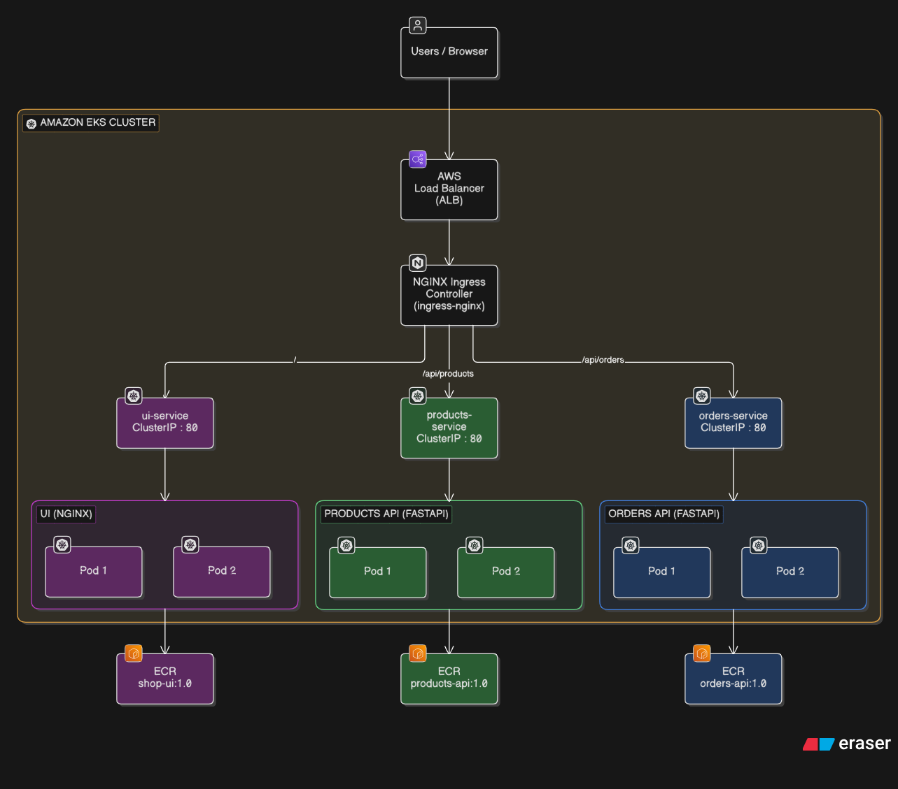

A containerized e-commerce application deployed on Amazon Elastic Kubernetes Service (Amazon EKS)** using an 
Application Load Balancer (ALB) and NGINX Ingress Controller for path-based routing.

User flow diagram: 

=========================
 PROJECT STRUCTURE
=========================
[Users / Browser]
       │
       ▼
[AWS Application Load Balancer (ALB)]
       │
       ▼
[NGINX Ingress Controller]
       │
       ├── /             ──► [ui-service]        ──► [UI Pods (Nginx)]
       ├── /api/products ──► [products-service]  ──► [Products API Pods (FastAPI)]
       └── /api/orders   ──► [orders-service]    ──► [Orders API Pods (FastAPI)]

=========================
 Tech stack
=========================
Cloud Platform:             AWS (Amazon EKS, AWS ALB, Amazon ECR)
Container Orchestration:    Kubernetes (Deployments, ClusterIP Services, Ingress)
Frontend:                   Nginx (shop-ui:1.0)
Backend APIs:               Python FastAPI (products-api:1.0, orders-api:1.0)

Ingress Controller: ingress-nginx
  
